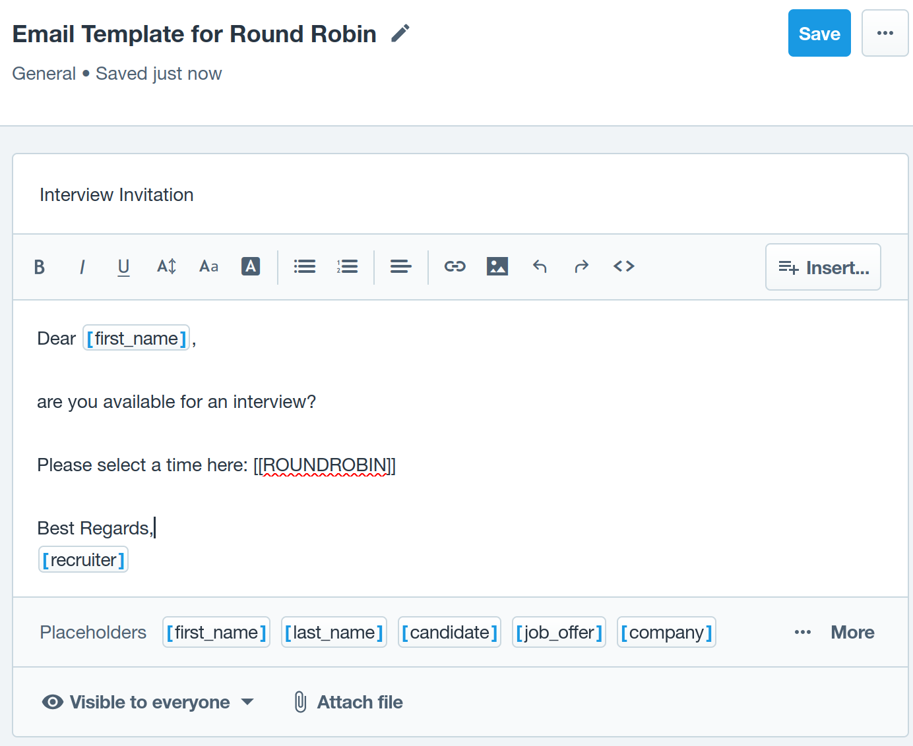

# Serverless Recruitee Round Robin Email Interview Invitation Event Scheduler Webhook
*Well, that's a mouthful.*
## Problem
For certain interviews (like screening interviews), you would like to have one interviewer out of a pool randomly assigned to the candidate. However it is not possible to create Event Schedulers in Recruitee that support round robin scheduling. This means you cannot use pipeline automations and have to send out invites by hand trying to keep the ratio between interviewers even. This webhook solves this issue by randomly assigning an interviewer and sending out an invite with a link to their according Event Scheduler when you move a candidate to a certain stage in your pipeline. It can easily be deployed to a serverless platform like [Vercel](https://vercel.com).
## Setup
### 1. Setup Recruitee
1. Go to the [Recruitee API Dashboard](https://app.recruitee.com/#/settings/api_tokens) and create a new API token
    
2. Create a new [Email template](https://app.recruitee.com/#/settings/emails/) and add `[[ROUNDROBIN]]` where you want the Webhook to insert the link
    
3. Add [Event Schedulers](https://app.recruitee.com/#/settings/scheduler) for every team member that you want to be included in the round robin rotation. **Every scheduler has to have the same name followed by a dash and a unique identifier!**
    
## 2. Deploy Webhook with Vercel
1. clone the repository
     ```
    git clone https://github.com/wingbackapp/recruitee-round-robin-interview-service.git
    ```
2. Create a new project in [Vercel](https://vercel.com) or just run `vercel --prod` from your project folder
3. Add the following environment variables to your vercel project:
    * **RECRUITEE_API_KEY**: the Recruitee [API Key](https://app.recruitee.com/#/settings/api_tokens) you created earlier
    * **RECRUITEE_COMPANY_ID**: your Recruitee [Company Id](https://app.recruitee.com/#/settings/api_tokens)
    * **RECRUITEE_COMPANY_DOMAIN**: your [Recruitee Domain](https://app.recruitee.com/#/settings/company/careers) without leading `https://` or trailing `/` *(this can also be your custom domain)* 
    * **RECRUITEE_WEBHOOK_SECRET**: set to `"--"` for now, **you will have to replace it later!**
### 3. Add Webhook to Recruitee
1. Compose your webhook url. It consists of:
    * The Vercel url
    * the path: `/api/webhook`
    * The name of the pipeline that should trigger the emails (Example: `Interview`)
    * The first part (before the dash) of the names of the Event Schedulers that you want the send invites from (in the example above: `First Interview`)
    * The email template that should be used for the invitations where your previously added `[[ROUNDROBIN]]` (in the Example above: `Email Template for Round Robin`)
2. Ensure that spelling and case is absolutely correct, replace all spaces with `%20` and assemble the url as follows:
    ```
    https://recruitee-round-robin-service-yourcompany.vercel.app/api/webhook?pipeline=Interview&schedulers=First%20Interview&template=Email%20Template%20for%Round%Robin
    ```
    If you access the url from your browser, it should show the following message:
    
3. Add a new [Recruitee Webhook](https://app.recruitee.com/#/settings/webhooks/overview)
    * **POST URL**: the url from above
    * Set it to send a message only when there is a **Pipeline change**
    
    * Press **Verify and create**. If you did everything right, this should complete successfully!
4. Click on **Show Secret**, verify yourself and obtain the Webhook Secret
    
### 4. Update Webhook Secret in Vercel
1. Update the **RECRUITEE_WEBHOOK_SECRET** environment variable in Vercel with your new secret
2. **You have to re-deploy the vercel service again for the change to take effect!**
### 5. Add Note Action to Pipeline (optional)
*This step is optional, but recommended so that your users will be notified that an email invitation will be sent out.*
1. Got to your [Pipeline Templates](https://app.recruitee.com/#/settings/pipeline_templates/) in Recruitee, select the Pipeline and Stage you are using for the Webhook and click **edit**.
2. Add an **Action** to **Add a Note** with a text similar to this and **Save** it
    ```
    this will send out an automatic interview invitation with the round robin scheduler webhook
    ```
3. Now, your users will see the message when they move a candidate to the pipeline stage to remind them of the automated action that is about to be triggered.
    
## Adding more Hooks
If you want to add additional hooks, just repeat step 3 with a different combination of pipeline, scheduler and email template. You do not have to get a new API Key or deploy a new vercel service.
## Troubleshooting
Please check the logs on the [Webhook Page](https://app.recruitee.com/#/settings/webhooks/logs) in Recruitee for more information.
